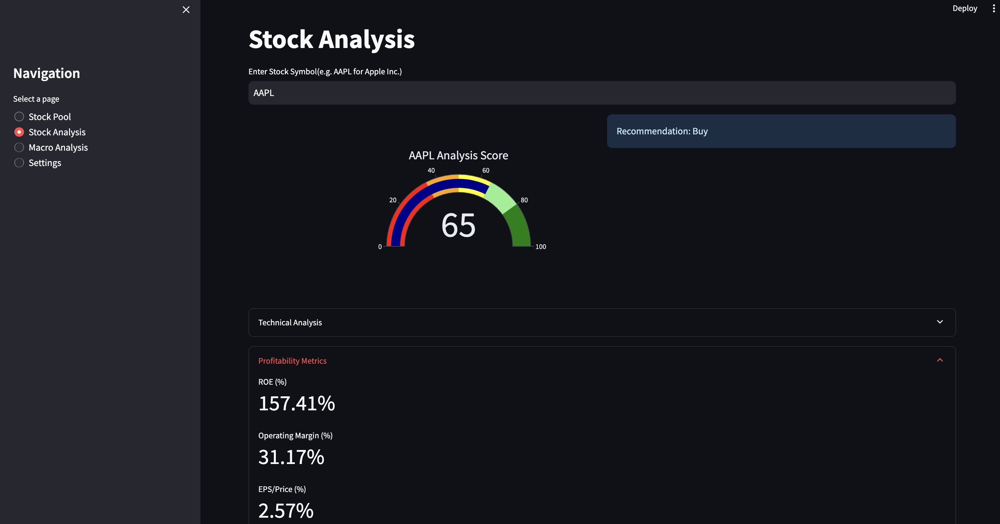
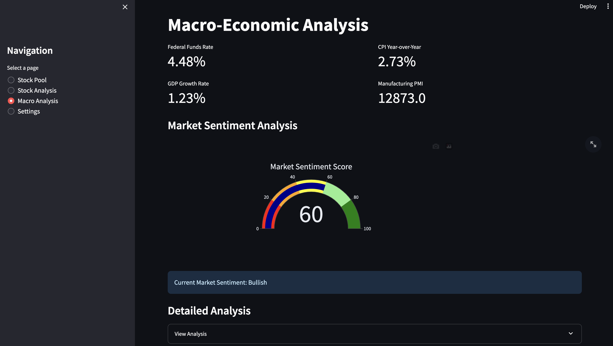
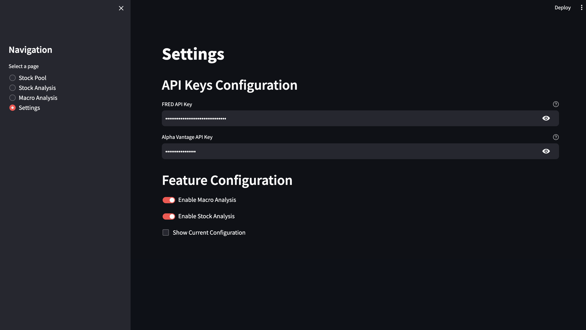

# Stock Financial Metrics Analysis

A Streamlit application for analyzing stock metrics and managing a stock portfolio.

## Features
- Stock Pool Management

- Fundamental Analysis

- Macro-Economic Analysis

- Settings


## Prerequisites
- Python 3.12 or higher
- Git

## Project Structure
```
stock-analyzer/
├── .env.template # Template for environment variables
├── .gitignore # Git ignore patterns
├── README.md # Project documentation
├── requirements.txt # Python dependencies
├── src/ # Source code
│ ├── components/ # UI components
│ ├── models/ # Data models
│ ├── utils/ # Utilities
│ └── main.py # Main application
├── config/ # Configuration files
└── data/ # Local data storage
```

## Setup and Installation

1. Create and activate a virtual environment:
```bash
# Create virtual environment with Python 3.12
python3.12 -m venv venv

# Activate virtual environment
# On macOS/Linux:
source venv/bin/activate
# On Windows:
.\venv\Scripts\activate
```

2. Upgrade pip and install required tools:
```bash
python -m pip install --upgrade pip setuptools wheel
```

3. Install the required dependencies:
```bash
pip install -r requirements.txt
```

4. Configure API keys in .env file:
```bash
cp .env.template .env
```
Edit the .env file with your API keys from:
- FRED API: https://fred.stlouisfed.org/docs/api/api_key.html
- Alpha Vantage API: https://www.alphavantage.co/

5. Run the application:
```bash
streamlit run app.py
```

5. Configure API keys:
   ```bash
   # Copy the template configuration file
   cp local_config.template.py local_config.py
   
   # Edit local_config.py with your API keys
   # Get your API keys from:
   # - FRED API: https://fred.stlouisfed.org/docs/api/api_key.html
   # - Alpha Vantage: https://www.alphavantage.co/
   ```

## Output Format
The application will display:
1. A formatted stock pool table containing:
- Working Capital (in millions)
- Free Cash Flow (in millions)
- Quick Ratio
- Current Ratio

2. A list of P/E ratios for the selected stocks for valuation
- Trailing Twelve Month P/E ratio
- Forward P/E ratio (Can be configured)

3. A list of profitability metrics for the selected stocks
- Operating Margin (%)
- Net Profit Margin (%)
- Return on Equity (ROE)
- Return on Assets (ROA)
- EPS/Price Ratio (%)

4. A recommendation based on the selected stocks marks
- Strong Buy/Buy/Hold/Sell/Strong Sell

## Troubleshooting

### Virtual Environment Issues
If you encounter issues with package imports or pip:

1. Ensure you're using the correct Python version:
```bash
python --version  # Should show Python 3.12.x
```

2. Verify virtual environment activation:
```bash
# You should see (venv) at the start of your prompt
# If not, reactivate the virtual environment
source venv/bin/activate  # On macOS/Linux
```

3. If problems persist, recreate the virtual environment:
```bash
# Remove old environment
rm -rf venv

# Create new environment
python3.12 -m venv venv

# Activate and install dependencies
source venv/bin/activate
python -m pip install --upgrade pip setuptools wheel
pip install -r requirements.txt
```

## Notes
- All monetary values (Working Capital and Free Cash Flow) are displayed in millions (M)
- The application uses the yfinance library to fetch financial data
- Due to rate limiting, you might need to wait a few seconds between requests
- Make sure you have a stable internet connection when running the application