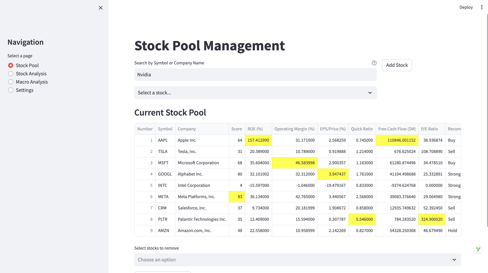
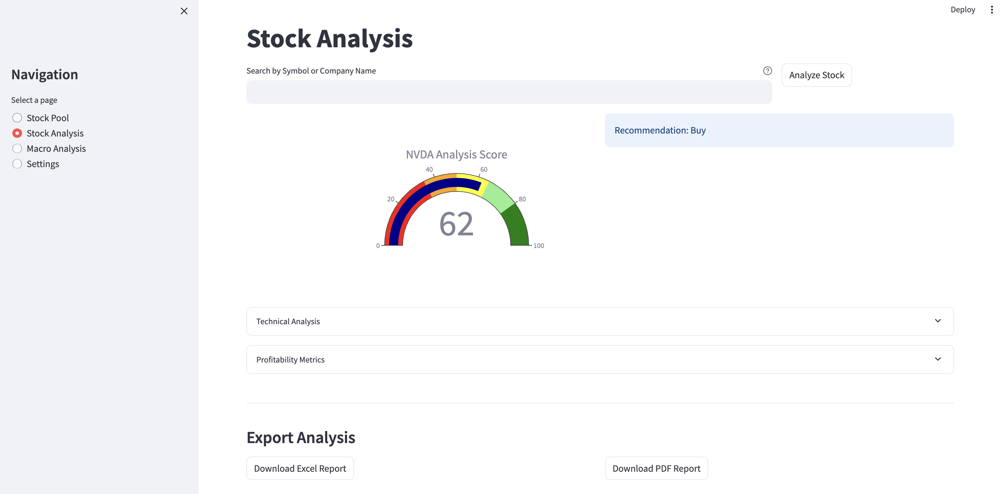
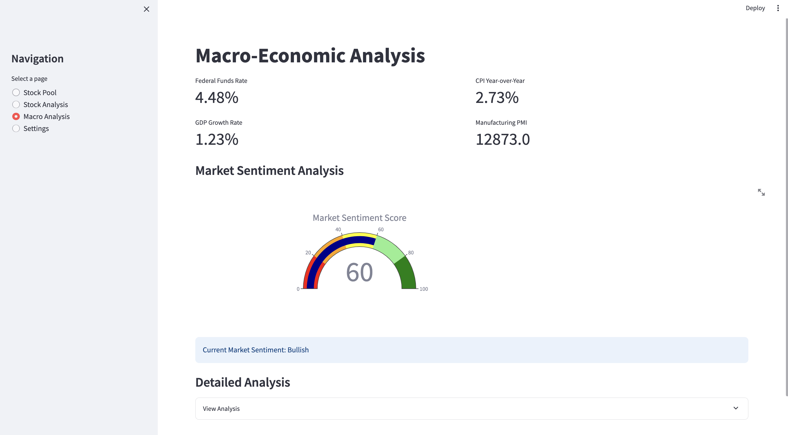
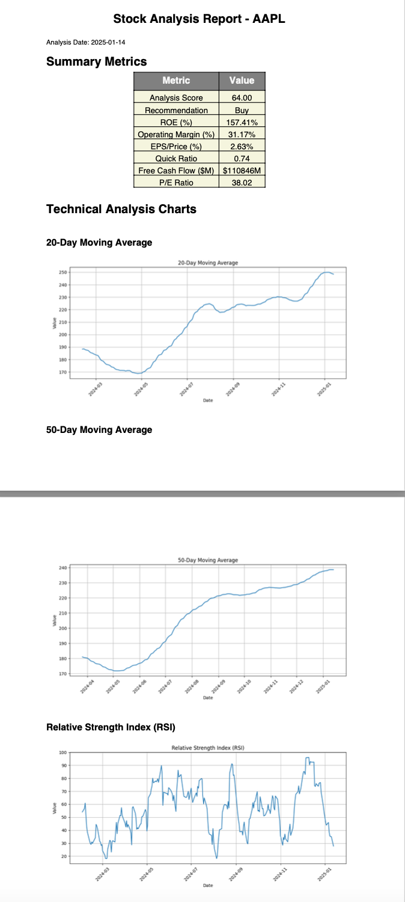

# Stock Analysis Application

A comprehensive stock analysis and portfolio management tool built with Python and Streamlit. It provides real-time market data, technical and fundamental analysis, multi-currency portfolio tracking, macro-economic indicators, and exportable research reports.

## Features

- **Markets** — Live watchlist with index overview, scoring, and recommendations
- **Portfolio** — Multi-currency portfolio tracker (SGD / HKD / USD) with P&L, allocation analysis, rebalancing suggestions, and performance charts
- **Stock Analysis** — Per-stock deep-dive with technical charts, fundamental metrics, and Excel / PDF export
- **Macro Analysis** — Fed Funds Rate, GDP, CPI, and PMI with a composite market sentiment score
- **Settings** — API key management and feature flag toggles

## Screenshots

**Markets — Watchlist & Index Overview**


**Stock Analysis — Score, Charts & Metrics**


**Macro Analysis — Economic Indicators**


**Research Reports — PDF Export**


## Quick Start

### 1. Clone the repository

```bash
git clone https://github.com/raymond0208/global-stock-analysis.git
cd global-stock-analysis
```

### 2. Create and activate a virtual environment

```bash
python -m venv venv
source venv/bin/activate        # macOS / Linux
venv\Scripts\activate           # Windows
```

### 3. Install dependencies

```bash
pip install -r requirements.txt
```

### 4. Configure API keys (optional)

Some features require external API keys. Copy the example config and fill in your keys:

| Key | Used for | Where to get it |
|-----|----------|-----------------|
| FRED API key | Macro Analysis page | [fred.stlouisfed.org](https://fred.stlouisfed.org/docs/api/api_key.html) |
| Alpha Vantage key | Alternative data source | [alphavantage.co](https://www.alphavantage.co/support/#api-key) |

Enter keys directly in **Settings** inside the app, or store them in a local config file (excluded from git).

### 5. Run the application

```bash
streamlit run app.py
```

Open [http://localhost:8501](http://localhost:8501) in your browser.

## Project Structure

```
global-stock-analysis/
├── app.py                        # Entry point
├── src/
│   ├── main.py                   # Navigation and session state
│   ├── components/
│   │   ├── stock_pool.py         # Markets page
│   │   ├── stock_analysis.py     # Stock Analysis page
│   │   ├── portfolio.py          # Portfolio page
│   │   ├── macro_analysis.py     # Macro Analysis page
│   │   └── settings.py           # Settings page
│   ├── models/
│   │   ├── stock_metrics.py      # Scoring and fundamental metrics
│   │   └── portfolio_metrics.py  # FX-aware portfolio calculations
│   └── utils/
│       └── storage_manager.py    # Persistent storage (JSON)
├── data/
│   └── portfolio.example.json    # Example portfolio record
├── docs/
│   └── user_guide.md
├── requirements.txt
└── README.md
```

## Dependencies

- Python 3.12+
- [Streamlit](https://streamlit.io) — UI framework
- [yfinance](https://github.com/ranaroussi/yfinance) — Live stock and FX data
- [Plotly](https://plotly.com/python/) — Interactive charts
- [pandas](https://pandas.pydata.org) — Data manipulation
- [fredapi](https://github.com/mortada/fredapi) — FRED economic data
- [reportlab](https://www.reportlab.com) — PDF report generation
- [xlsxwriter](https://xlsxwriter.readthedocs.io) — Excel report generation

See `requirements.txt` for the full list with pinned versions.

## Documentation

For detailed usage instructions, see the [User Guide](docs/user_guide.md).

## Contributing

Contributions are welcome. Please open an issue first to discuss what you would like to change, then submit a Pull Request.

## License

Licensed under the Apache License 2.0 — see the `LICENSE` file for details.

## Disclaimer

This application is for informational purposes only. Nothing in it constitutes financial advice. Always conduct your own research and consult a qualified financial professional before making investment decisions.
